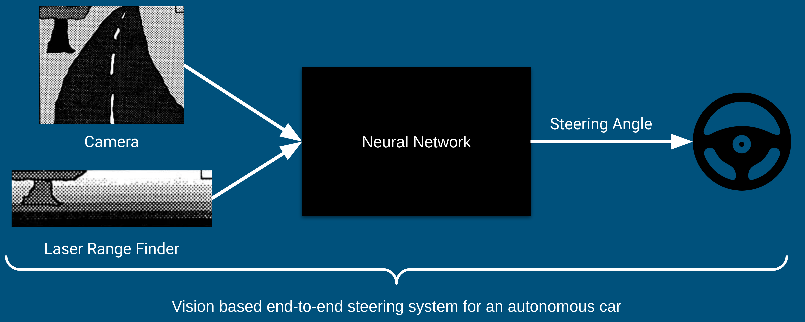

# Using an Artificial Neural Network for the Task of Road Following

This repository contains code to train a neural network for the
task of road following. The network is provided with street images 
and outputs the corresponding steering wheel angles to drive a 
car on the street autonomously. The algorithm is based on the
neural network described in the paper ["ALVINN: An Autonomous Land 
Vehicle in a Neural Network"](https://www.ri.cmu.edu/publications/alvinn-an-autonomous-land-vehicle-in-a-neural-network/)
(1989) by Pomerleau. 
This project was created during the seminar 
"Algorithms for Imitation Learning" at the University of Stuttgart.

## Installation

- Create a ``data/`` folder in the root of the repository with the following data set files:
    - ``data/track_data_2.h5``
    - ``data/camera/2016-06-08--11-46-01.h5``
    - ``data/log/2016-06-08--11-46-01.h5``
- Create a pip env: ``python3 -m venv env``
- Activate the environment: ``source env/bin/activate``
- Install dependencies: ``pip install -r requirements.txt``
- Start the jupyter notebook: ``jupyter notebook``
- Now you can view the notebook ``Seminar_ImitationLearning_FabianHauck.ipynb``

### OR use Docker to run the notebook with GPU support

- Copy the date set in the respective folders as 
described above
- Build and run the Docker container with ``docker/start.sh`` from the repository root
- The notebook is now available under [http://localhost:8888](http://localhost:8888/)
- The token to access it is ``b0355f51bc6f93f72553da74bb6548801e64b2f9689ad96c``